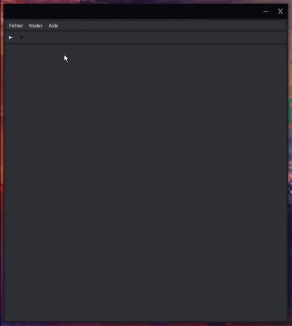
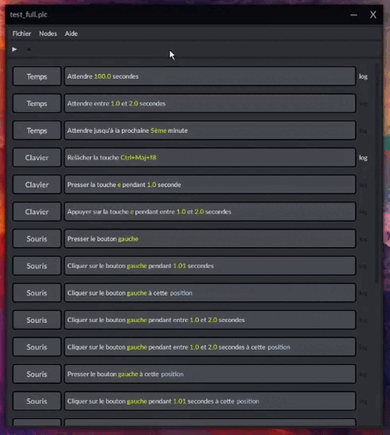

# Automation
Logiciel d'automatisation, configurable façon "no-code". Créé de façon à ce qu'il soit facile d'y ajouter des fonctionnalités.  
J'ai développé ce logiciel afin d'avoir un moyen facile de créer des automatisations sans avoir à coder un nouveau programme à chaque fois.  

Ce qu'il fait:
* Vous pouvez placer autant de nodes que vous le souhaitez, elles seront exécutées les unes après les autres
* Les nodes sont:
   * Temps: attendre un certain moment (en seconde) ou une heure spécifique
   * Clavier: simuler une touche ou un raccourci en l'appuyant, le pressant ou le relâchant
   * Souris: simuler un déplacement, un clic ou un scroll avec la souris
   * Checkpoint: attendre un input spécifique de la part de l'utilisateur avant de passer à la suite
* Les nodes peuvent être ajoutées, insérées, supprimées ou encore déplacées afin de changer leur ordre
* Pour chaque node, vous pouvez choisir d'activer si oui ou non un message sera affiché dans les logs à chaque fois qu'elle est exécutée
* Les nodes peuvent être sauvegardées dans un fichier et chargées de nouveau quand on le souhaite
* En cas d'urgence, on peut presser trois fois une touche (modifiable) afin d'arrêter la boucle
* Ce logiciel peut être mis à jour en utilisant un autre de mes logiciels appelé Updater
 

 
Il existe un mode "enregistrer" qui permet de créer des systèmes de nodes complexes facilement
  

 
Il est possible de traduire tous les textes du logiciel en un seul clic
  

