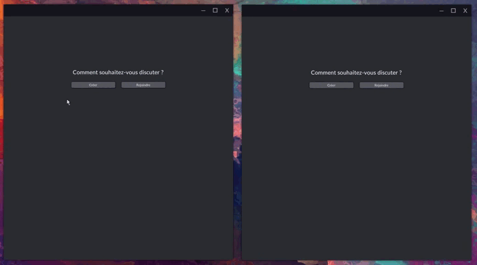
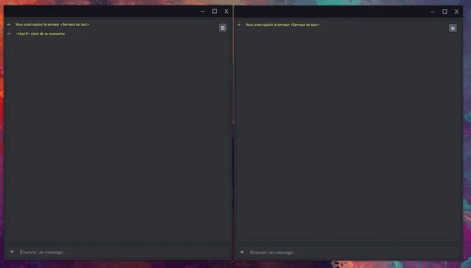
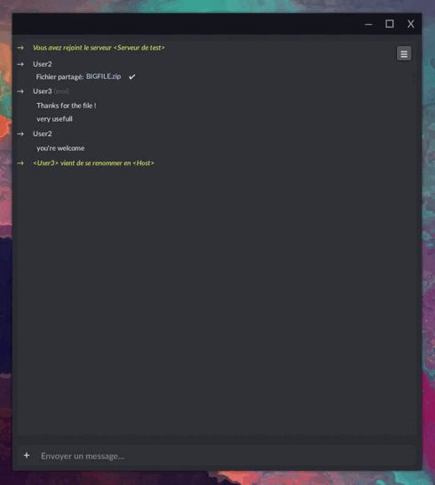

# Chat
Communications software. Allows you to create sessions to communicate and share documents with a large number of participants.  

What can be done:
* You can create a session on the local network but also remotely, using the IP address to connect
* Clients have access to the list of the last 5 servers they joined, with an indicator to know if they are still active or not, so they can simply return to them
* Once in the session it is possible to send messages or files at will
* It is possible to change your name during a session
* During the session, the host can change the password, accept or reject new participants, reshare files or even exclude participants
* This software can be updated using another software of mine called Updater.
 

 
You can share files without size limits. Error checking will be performed to verify file integrity.  
 

 
You can change your name during a session.  
 

