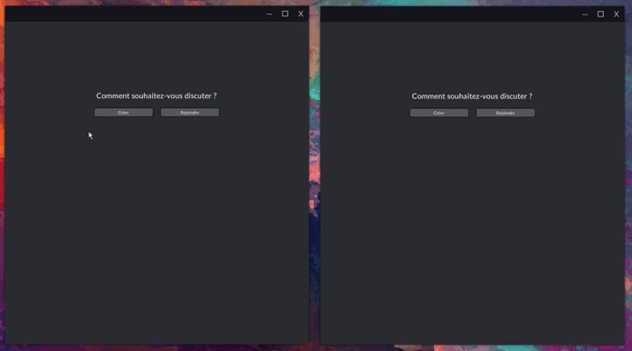
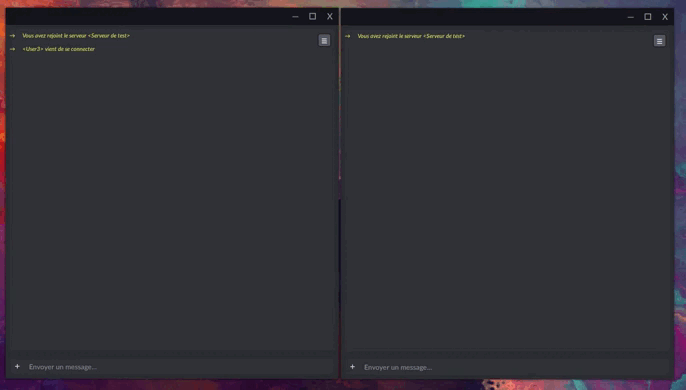
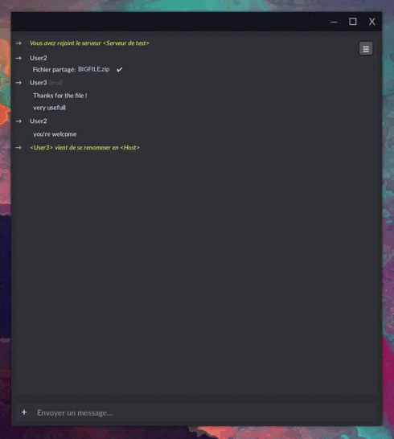

# Chat
Logiciel de communication. Permet de créer des sessions pour communiquer et partager des documents avec un grand nombre de participants.  

ce qu'il est possible de faire:
* Vous pouvez créer une session sur le réseau local mais aussi à distance, en utilisant l'adresse IP pour se connecter
* Les clients ont accès à la liste des 5 derniers serveurs qu'ils ont rejoints, avec un indicateur permettant de savoir s'ils sont toujours actifs ou non, afin d'y revenir simplement
* Une fois dans la session il est possible d'envoyer des messages ou des fichiers à volonté
* Il est possible de change son nom pendant un session
* En cours de session, l'hôte peut changer le mot de passe, accepter ou rejeter de nouveaux participants, repartager des fichiers ou encore exclure des participants
* Ce logiciel peut être mis à jour en utilisant un autre de mes logiciels appelé Updater.
 

 
Vous pouvez partager des fichiers sans limite de taille. Une vérification des erreurs sera effectuée afin de vérifier l'intégrité des fichiers.  
 

 
Vous pouvez changer votre nom pendant une session.  
 

