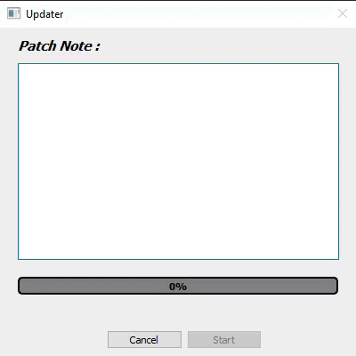

# Python
Various projects created with python

1) Communication software. Allows you to create sessions with passwords and communicate regardless of the number of participants. This software uses a lot of my previous work gathered under a toolkit. This makes it easier to create frameless applications, create scroll areas, threads, animations or even update the application.

2) Software used to update all my other software. Uses google drive, an .ignore system and allows to display the patch note before downloading. Created so that adding it to my future projects is simple

3) Software that automates the distribution of classes in a school

4) Software to automate tasks, configurable in a "no code" way. Created to make it easy to add new features

5) Screenshot and GIF capture software

6) Sudoku solving software

