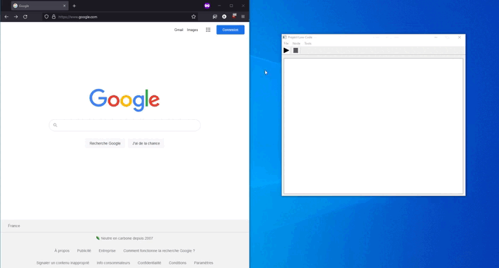
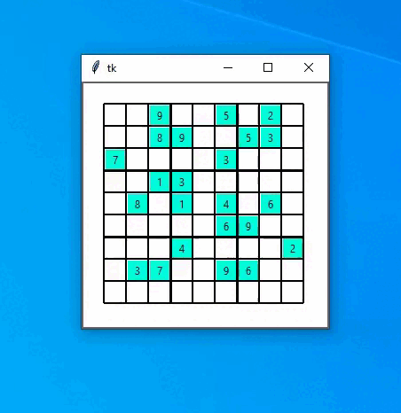

# Python
Various projects created with python

1) Software that automates the distribution of classes in a school

2) Software to automate tasks, configurable in a "no code" way. Created to make it easy to add new features

3) Screenshot and GIF capture software

4) Sudoku solving software

