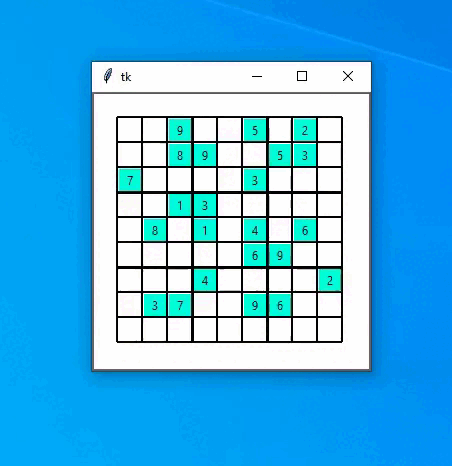

# Sudoku Resolver
Software used to solve Sudoku.  
This was my first attempt ever to create a GUI in Python with Tkinter.  
Not perfect because I coded the rules by hand rather than creating an algorithm to brute force it.  

