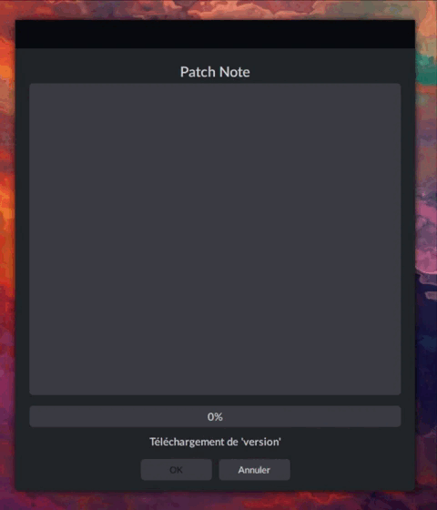

# Updater
Launching from my other projects to update them.

What can be done:
- Downloads the .zip of the new version on Google Drive
- Shows the list of changes of each version
- Uses the changelist and an .ignore file to update the software by making only the necessary changes
- Reopens the updated software, before closing
 

