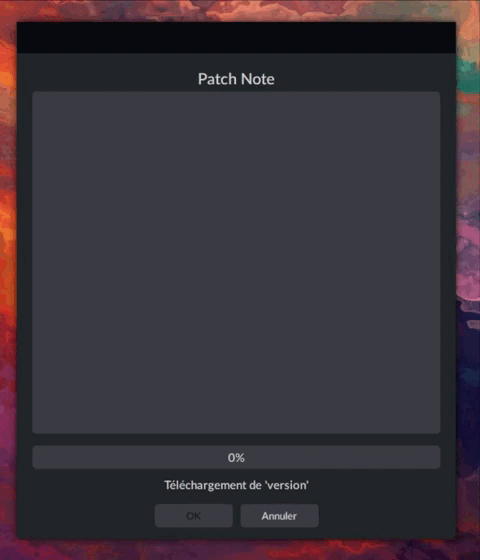

# Updater
Software launch from my other projects in order to update them.
Easy to launch from my other projects with

What it does:
- Downloads the .zip of the new version on google drive
- Displays the patch note on screen
- Uses the list of changes and a .ignore file to update the software
- Re-opens updated software while closing
 

